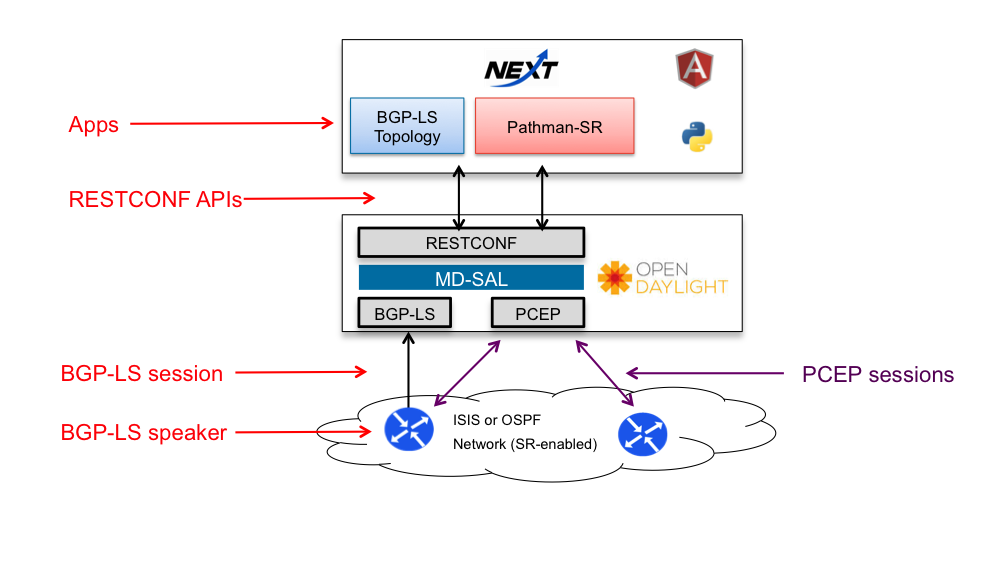

# OpenDaylight Pathman SR App <a style="float:right " href="https://dcloud.cisco.com/"></a>  


Figure 0. Pathman-SR Logo

OpenDaylight (ODL) is an open-source application development and delivery platform. Segment Routing (SR) is a new and scalable method for forwarding packets across MPLS or IPv6 networks. It employs a form of source routing by appending to each packet a header representing different segments (e.g.nodes, links, etc.) that the packet should be routed through. Pathman-SR is an application developed on top of ODL enabling the user to program SR-paths through the network. 


## Team:

- Niklas Montin
- Alex Zverev
- Chris Metz
- Giles Heron

### Project demo Link:

[https://github.com/CiscoDevNet/pathman-sr](https://github.com/CiscoDevNet/pathman-sr)

### Video overview:

[https://youtu.be/n-G2Cvz7xFU](https://youtu.be/n-G2Cvz7xFU)

### Contact Email:

<pathman-sr@external.cisco.com>

### Social Tags:

SDN, Open Source, NexT, IP, MPLS, BGP, BGP-LS, OSPF, ISIS, Traffic Engineering, RESTCONF API, YANG, Segment Routing

### Project Kick-off Date:

January 2016

### Current Status:

Beta

### Application Overview

A brief description of segment routing is contained in the abstract of [Segment Routing Architecture draft](https://tools.ietf.org/html/draft-filsfils-spring-segment-routing):

>"..Segment Routing (SR) leverages the source routing paradigm.  A node
   steers a packet through an ordered list of instructions, called
   segments.  A segment can represent any instruction, topological or
   service-based.  A segment can have a local semantic to an SR node or
   global within an SR domain.  SR allows to enforce a flow through any
   topological path and service chain while maintaining per-flow state
   only at the ingress node to the SR domain.."

Pathman-SR is an extension of the Pathman application but in this case, it is used to program SR-paths only through the network.
An overview of the architecture laid out in [Pathman](https://github.com/CiscoDevNet/Opendaylight-BGP-Pathman-apps) is applicable to Pathman-SR so the text won't be repeated here. 

For completeness the architecture for Pathman-SR is depicted here.


Figure 1. Pathman-SR Architecture

The Pathman-SR architecture is similar to the Pathman architecture. It uses BGP-LS to collect and render the network. It uses PCEP to program SR segment stacks on the ingress router which define the path of segments packets should traverse (aka SR-path) 

A little color is added below on some of the components of the app itself. This might help those who are reviewing the code to better understand some of the pieces. 

The front-end of the app uses:
- NeXt is the UI framework used to render topologies and graphs. This is open source and a [formal ODL project](https://wiki.opendaylight.org/view/NeXt:Main).
- [AngularJS](https://angularjs.org/) is a popular UI framework based on the model-view-controller (MVC) paradigm. This enables efficient/modularized development/testing of the code.
 
The back-end of the app employs a number of Python modules that among other things compute SR-path candidates and execute RESTCONF API calls directly to ODL. The combination of the Pathman-SR application front-end and back-end provide an excellent example of a working ODL application.

A final note: some or all of the routers must support segmenting routing (software configuration knob). In this example all routers have SR turned on (denoted by a small "SR" icon). In actual deployments a subset of the routers would have SR turned. 

### Pathman-SR Examples

The following are example screenshots from Pathman-SR illustating the look/feel of specific functions. The nodes shown in the topology display a "PC" icon meaning it supports PCEP which is the protocol running between the router or ODL carrying SR-path segment stacks. This means the router can be an ingress or head-end for an SR-path. The "SR" indicates it supports segmenting routing an ingress, egress or intermediate router. Just to avoid any confusion Pathman-SR only supports SR-path management.


Figure 2. Search for an optimal path

In this example an SR-path between atl and chi has been requested. This panel shows the SR-paths computed. The path selected on the right is highlighted in the topology on the left. 


Figure 3. Path has been deployed

This shows the selected path that was in turn deployed (programmed) into the network.


Figure 4. List of all deployed paths

This panel shows the list of deployed (active) SR-paths on the right and the selected one is highlighted in the topology.


Figure 5. Random node info. Link and/or path details are also available in one-two-click

And finally the panel provides information on specific nodes.

## Prerequisites
### For Pathman SR users
You need to have Python 2.7 installed on your PC/Mac.

Before you start a web server, make sure you have the required PyPi packages installed:

```
pip install tornado
pip install requests
```

PyPi is a package manager for Python. It provides a command line utility *pip* to install the packages. Normally, PyPi comes with Python. If that's not the case, try to figure out why it is not running on your system.

### For Pathman SR frontend devs
Install node.js (server-side JavaScript environment) from [nodejs.org](https://nodejs.org).

Node.js comes with NPM (Node.js package manager), which allows you to install various modules.

We will install a few of them:

```
npm install bower -g
npm install gulp -g
```

*Bower* is a package manager for frontend, and *Gulp* is a frontend compilation tool. *-g* is flag that will install the packages globally and will reserve the CLI commands.

Assuming you are currently in the root directory of the project, navigate to *client-src/pathman-sr/* directory with *cd*:

```
cd client-src/pathman_sr
```

All GUI files are located in here.

Run the following commands to install and update vendor packages:

```
npm install
bower install
```

Once finished, you may want to reassemble frontend code. There are the two ways for doing so.

1. Rebuild and activate file watchers. File watchers would track changes in the files and would trigger the compilation process automatically. Just run this:


	```
	gulp
	```

2. To clean the build folder and rebuild the code, run the following commands:
	
	```
	gulp clean && gulp build
	```

### Configuration
Config goes in pathman_ini.py

## Run Pathman SR

Once your system meets the prerequisites requirements above, you're ready to spin up a web-server for Pathman SR. This gives you the way of interaction between the app's modules. 

To start the server, type the following command to CLI and run it (caution: your need to run it in context of the app's root folder):

```
python ./rest_server_v6.py
```

If your system is asking you to give permission for incomming connection, approve them.

In about a moment, the URL of Pathman would be <http://localhost:8020/cisco-ctao/apps/pathman_sr/index.html>

Run log goes to pathman.log

## For Use with dCloud Topology, Setup and Troubleshooting hints
Go here for [details](https://github.com/CiscoDevNet/pathman-sr/tree/master/dCloud)

## To use with Docker
Go here for [details](https://github.com/CiscoDevNet/pathman-sr/tree/master/docker)

## For Tools to help you get PCEP, BGP-LS and Netconf setup
Go here for [details](https://github.com/CiscoDevNet/pathman-sr/tree/master/tools)


