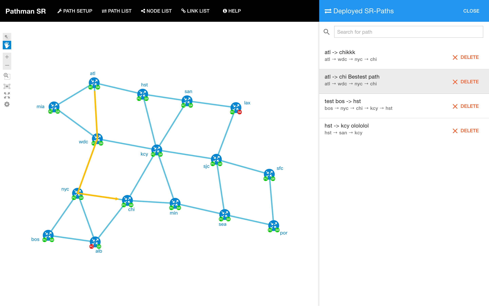

# OpenDaylight Pathman SR App

OpenDaylight (ODL) is an open-source application development and delivery platform. Segment Route (SR) is a new and scalable method for forwarding packets across MPLS or IPv6 networks. It employs a form of source routing by appending to each packet a header representing different nodes, links, etc. that the packet should be routed through. Pathman SR is an application developed on top of ODL enabling the user to program SR paths through the network. 

## Team:

- Niklas Montin
- Alex Zverev
- Chris Metz
- Giles Heron

### Project demo Link:

[https://github.com/CiscoDevNet/pathman-sr](https://github.com/CiscoDevNet/pathman-sr)

### Social Tags:

SDN, Open Source, NexT, IP, MPLS, BGP, BGP-LS, OSPF, ISIS, Traffic Engineering, RESTCONF API, YANG, Segment Routing

### Project Kick-off Date:

January 2016

### Current Status:

Beta

### Application Overview

A brief description of segment routing is contained in the abstract of [Segment Routing Architecture draft](https://tools.ietf.org/html/draft-filsfils-spring-segment-routing):

```"..Segment Routing (SR) leverages the source routing paradigm.  A node
   steers a packet through an ordered list of instructions, called
   segments.  A segment can represent any instruction, topological or
   service-based.  A segment can have a local semantic to an SR node or
   global within an SR domain.  SR allows to enforce a flow through any
   topological path and service chain while maintaining per-flow state
   only at the ingress node to the SR domain.."```

Pathman-SR is an extension of the Pathman application but in this case, it is used to program SR paths through the network.
A general overview of the architecture laid out in [Pathman](https://github.com/CiscoDevNet/Opendaylight-BGP-Pathman-apps) is applicable to Pathman-SR so won't be repeated here. 

PathMan Segment Routing (SR) is set up to run the exact same way as the PathMan and BGP app.


Figure 1. Search for an optimal path


Figure 2. Path has been deployed


Figure 3. List of all deployed paths


Figure 4. Random node info. Link and/or path details are also available in one-two-click

## Prerequisites
### For Pathman SR users
You need to have Python 2.7 installed on your PC/Mac.

Before you start a web server, make sure you have the required PyPi packages installed:

```
pip install tornado
pip install requests
```

PyPi is a package manager for Python. It provides a command line utility *pip* to install the packages. Normally, PyPi comes with Python. If that's not the case, try to figure out why it is not running on your system.

### For Pathman SR frontend devs
Install node.js (server-side JavaScript environment) from [nodejs.org](https://nodejs.org).

Node.js comes with NPM (Node.js package manager), which allows you to install various modules.

We will install a few of them:

```
npm install bower -g
npm install gulp -g
```

*Bower* is a package manager for frontend, and *Gulp* is a frontend compilation tool. *-g* is flag that will install the packages globally and will reserve the CLI commands.

Assuming you are currently in the root directory of the project, navigate to *client* directory with *cd*:

```
cd client
```

All GUI files are located in here.

Run the following commands to install and update vendor packages:

```
npm install
bower install
```

Once finished, you may want to reassemble frontend code. There are the two ways for doing so.

1. Rebuild and activate file watchers. File watchers would track changes in the files and would trigger the compilation process automatically. Just run this:


	```
	gulp
	```

2. To clean the build folder and rebuild the code, run the following commands:
	
	```
	gulp clean
	gulp build
	```

### Configuration
Config goes in pathman_ini.py

## Run Pathman SR

Once your system meets the prerequisites requirements above, you're ready to spin up a web-server for Pathman SR. This gives you the way to interact with 

To start the server, type the following command to CLI and run it (caution: your need to run it in context of the app's root folder):

```
python ./rest_server_v6.py
```

If your system is asking you to give permission for incomming connection, approve them.

In about a moment, the URL of Pathman would be <http://localhost:8020/cisco-ctao/apps/pathman_sr/index.html>
**Note**: The current url is <http://localhost:8020/cisco-ctao/apps/build/index.html>, but it will be changed to the above.

Run log goes to pathman.log

## For Use with dCloud Topology, Setup and Troubleshooting hints
Go here for [details](https://github.com/CiscoDevNet/pathman-sr/tree/master/dCloud)


