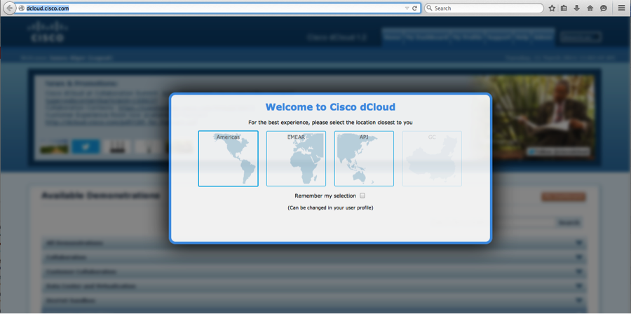
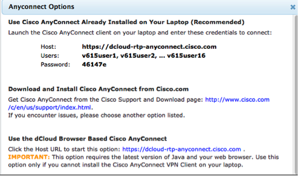
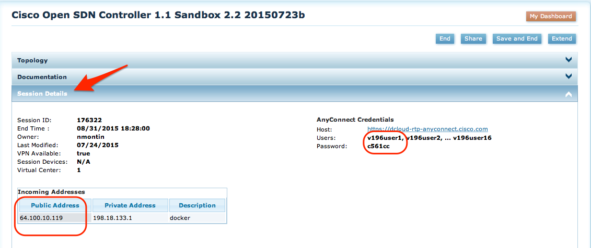

# Running your OpenDaylight APPs towards a Topology
Updated: 20160609

The BGP and PCEP (Pathman) apps assume that you can connect to an OpenDaylight (ODL) Controller.

You will need the following information:

1. IP address and Port of controller
2. Authorization in the form of username and password

You topology would also need to be configured to interact with the ODL controller; BGP peering with BGP-LS speaker (i.e. one of the routers configured with BGP-LS) and PCEP peering enabled in all routers.

To simplify this step, we have implement a demonstration ODL controller and network topology available at [dCloud](dcloud.cisco.com). Below you will find the information required to have these apps interact with dCloud.

# Accessing OpenDaylight Beryllium SR1/SR2 at dCloud

First, you need to connect to [dcloud.cisco.com](http://dcloud.cisco.com) and signup. If you are a new user, you may need to first signup at [cco.cisco.com](http://cco.cisco.com), and then at [dcloud](http://dcloud.cisco.com).

When connecting to dcloud, you will first be prompted to select a datacenter near you (shown in 1). After that you will be prompted to set up a profile.

- If you have any trouble in getting your profile setup, please consult the Help tab.



Figure 1 dCloud data center selection screen

Once connected to [dCloud](http://dcloud.cisco.com), you will see the content overview. From there, select Service Provider, and locate the [OpenDayLight Beryllium SR1 with Apps with 8 nodes v1.](https://dcloud-cms.cisco.com/demo/opendaylight-beryllium-sr1-with-apps-with-8-nodes-v1) demo.

Note that any newer ODL demo should work fine as well.

- --Then select Start/Schedule and pick a time for when you want to have access to the topology, or now.
- --Select the Session End time.
- --Click Next and answer the "use" questions.


Now you are done and you should have a session being started for you.

# How do I configure my APP to talk to my dCloud ODL + topology?

**Note:**
The Pathman_SR app has been tested with Lithium SR3 and Beryllium SR1 and SR2


**No changes are needed to run this app towards the above-mentioned topology in dCloud.**

For other setups, you may need to change ip/port/auth details.

In your distribution, you will find two top-directories; pathman and next.

In **pathman_ini.py** you will find:

```
odl_ip = '198.18.1.80'
odl_port = '8181'
odl_user = 'admin'
odl_password = 'admin'
```

These values are fine once you have any-connected in to the dCloud session.
(To use your own topology, edit these values to point to your local controller.)

# How do I connect my laptop to the dCloud topology?

Depending on where you have installed the apps, you may want to consider different options to access your active dCloud session.

1. Cisco AnyConnect Client - [http://www.cisco.com/c/en/us/products/security/anyconnect-secure-mobility-client/index.html](http://www.cisco.com/c/en/us/products/security/anyconnect-secure-mobility-client/index.html)

2. Openconnect – see [https://wiki.archlinux.org/index.php/OpenConnect](https://wiki.archlinux.org/index.php/OpenConnect)

Regardless of client, you will need to check the access details for your session.

At dcloud.cisco.com, and the datacenter you have selected – click _My Dashboard_ and you will find your active session(s) listed there.

Select you session's '_View'_ button and then '_Review Session Info_', which takes you to _Session Details_. In Session Details, you will find your AnyConnect credentials.

And if you 'click here for available options', you will see a view like this:



Figure 2 Anyconnect session credentials screen

Once connected, your laptop will be in the same network as the routers in your topology and the Lithium ODL controller.

Routers are at: 198.18.1.30 – 37. Username/password is cisco/cisco

Your ODL controller is at 198.18.1.80, ssh to port 8022 user/pass: cisco/cisco

Karaf is at 198.18.1.80, ssh to port 8101, user/password: karaf/karaf

RESTCONF API access to ODL is at 198.18.1.80, port 8181, user/password: admin/admin

# How to Configure and Launch BGP-LS Manager and Pathman Apps

1. Software prerequisites (above and beyond what is required for dCloud access):

    - Chrome Version 45.0.2454.101 (64-bit) or higher
    - Python 2.7 or 2.6
    - Tornado 4.2.1
    - requests 2.6.0

2. Schedule and have a dCloud Beryllium ODL demo (per the above).

3. Download BGP-LS Manager and Pathman apps from github located at [CiscoDevnet's Github](https://github.com/CiscoDevNet/pathman-sr)

 ```
 mkdir pathman_sr
 cd pathman_sr
 git init
 git pull https://github.com/CiscoDevNet/pathman-sr
 ```

4. You should the following in your current directory (pathman_sr).

 ```
drwxr-xr-x  13 staff    442 Jun  8 11:10 .git
-rw-r--r--   1 staff     64 Jun  8 11:10 .gitignore
-rw-r--r--   1 staff   2660 Jun  8 11:10 README.md
drwxr-xr-x   8 staff    272 Jun  8 11:10 client
drwxr-xr-x   4 staff    136 Jun  8 11:53 dCloud
drwxr-xr-x   6 staff    204 Jun  8 11:10 demo
-rwxr-xr-x   1 staff     92 Jun  8 11:10 launch_rest.sh
-rw-r--r--   1 staff    842 Jun  8 11:17 pathman_ini.py
-rw-r--r--   1 staff    744 Jun  8 11:10 pathman_logging.conf
-rw-r--r--   1 staff  56602 Jun  8 11:25 pathman_sr.py
-rwxr-xr-x   1 staff   3069 Jun  8 11:10 rest_server_v6.py
-rwxr-xr-x   1 staff   2951 Jun  8 11:10 server_pathman.py
-rwxr-xr-x   1 staff   3218 Jun  8 11:10 server_sr.py
-rw-r--r--   1 staff  24140 Jun  8 11:10 topo_data.py
```

5. Next modify the pathman\_ini.py file to point to the remote ODL instance. No change is required if you are using a dcloud ODL session.

6. Type in the following command to start the rest_server:

 ``` 
 python rest_server_v6.py. 
 ```
 
 This launches the "backend" of the Pathman_sr app.

7. Open your Chrome Browser

8. URL to launch Pathman_SR: [http://localhost:8020/cisco-ctao/apps/pathman_sr/index.html](http://localhost:8020/cisco-ctao/apps/pathman_sr/index.html). This assumes that your app is running on your local host.

**NOTE**: Current code may use this url: [http://localhost:8020/cisco-ctao/apps/build/index.html](http://localhost:8020/cisco-ctao/apps/build/index.html)

# What if I don't have Cisco Anyconnect installed?

There are two options; either you use an alternate client, or you use dCloud's public ip solution.

## Alternate Anyconnect client
-If your client can't run Cisco Anyconnect, you want to try another client like OpenConnect.

## dCloud Topology Public IP Access
For some of our demos, we have enabled public IP access. In the picture below, you see how to find your public_ip address, and your anyconnect credentials.

You can use them directly from your Pathman_SR app, by changing the pathman\_ini.py file as described below.

```
odl_ip = '64.100.10.119'   # from Public Address
odl_port = '6644'          # must be 6644 to reach dCloud ODL servers restconf
odl_user = 'v196user1'     # your sessions anyconnect userid for user1
odl_password = 'c561cc'    # your sessions anyconnect password
```




### FAQ on Public IP and dCloud Demos
1. Can more than one app run towards the same topology from your machine - **Yes**
2. Can someone else access your topology? - **No**, unless you share access credentials with them.
3. Should you share your access credentials with everyone through my blog/Facebook or other? **No**, that is probably **not** a good idea.
4. Can I choose to collaborate with few others? **Yes**, you can either share your demo with them through the **Share** button on the dCloud UI, or share your sessions access credentials. Just remember that once shared, they have learned your credentials and can access your setup at any time.
5. How long can I have my topology running? Your session can be scheduled to run for, from 1h to 5 Days.
6. Is there a charge for using dCloud? - **No**, currently there is no charge for using dcloud for this purpose.


# Troubleshooting
For any issues, first take a look at the **/tmp/pathman.log** file

##Things to look for in the log
1. Did I connect to my odl controller? This should be the first lines in your log.
 
 ```
 71679 2016-06-08 21:14:40.033 UTC root:<module>     INFO: This is initializing the log
 71679 2016-06-08 21:14:40.263 UTC root:get_url      INFO: Url get Status: 200
 71679 2016-06-08 21:14:40.464 UTC root:get_url      INFO: Url get Status: 200
 ```
 This is what Failure could look like, once the url's timeout.
 
 ```
 71987 2016-06-08 21:16:20.277 UTC root:<module>     INFO: This is initializing the log
71987 2016-06-08 21:17:35.985 UTC root:get_url      ERROR: Connection Error: ('Connection aborted.', error(60, 'Operation timed out'))
71987 2016-06-08 21:18:51.357 UTC root:get_url      ERROR: Connection Error: ('Connection aborted.', error(60, 'Operation timed out'))
71987 2016-06-08 21:18:51.357 UTC root:get_pcep_type INFO: We have no nodes in our PCEP Topology
71987 2016-06-08 21:18:51.357 UTC root:node_structure INFO: We have no nodes in our BGP-LS topology
71987 2016-06-08 21:18:51.357 UTC root:pseudo_net_build INFO: []
71987 2016-06-08 21:20:06.631 UTC root:get_url      ERROR: Connection Error: ('Connection aborted.', error(60, 'Operation timed out'))
71987 2016-06-08 21:20:06.632 UTC root:netconf_list ERROR: format error in netconf node-list: {}
71987 2016-06-08 21:20:06.632 UTC root:node_links   INFO: We have no links in our BGP-LS topology
71987 2016-06-08 21:20:06.632 UTC root:node_links   INFO: We have no links in our BGP-LS topology
 ```
 
2. Did I learn any nodes from the controller? Early in the log you want to see something like this - one node statement per node:

 ```
 65632 2016-06-08 20:34:31.496 UTC root:node_structure INFO: New node: Node(name='sjc', id=u'3323134238', loopback=u'198.19.1.30', portlist=[u'57.0.0.30', u'49.0.0.30', u'55.0.0.30', u'46.0.0.30', u'56.0.0.30'], pcc='', pcep_type='', prefix=[u'57.0.0.0/24', u'46.0.0.0/24', u'56.0.0.0/24', u'55.0.0.0/24', u'49.0.0.0/24', u'198.19.1.30/32'], sid='')
 ```
 
 ```
65632 2016-06-08 20:34:39.039 UTC root:getTopo      INFO: Topo build with 8 nodes
```
3. Did I enable Segment Routing? You should see a line per router saying that the SID has been set.

 ```
 65632 2016-06-08 20:34:39.035 UTC root:update       INFO: SR sid updated for: sjc
 ```
4. Could I see any LSPs?  Below is an example for what you should see in the log as you start your server, after the above output.

 ```
 65632 2016-06-08 20:34:39.041 UTC root:rest_interface_parser INFO: Commands Recieved: {u'option': u'list_all'}
65632 2016-06-08 20:34:39.238 UTC root:get_url      INFO: Url get Status: 200
65632 2016-06-08 20:34:39.238 UTC root:listAllLsp   INFO: list: [], formatted: []
```
5. Did my REST server start? If it did startok, you should see this in the log.

 ```
 65632 2016-06-08 20:24:56.003 UTC root:__init__     INFO: patterned to '/pathman'
 65632 2016-06-08 20:24:56.006 UTC root:__init__     INFO: Pathman REST API Launched on port 8020
```
